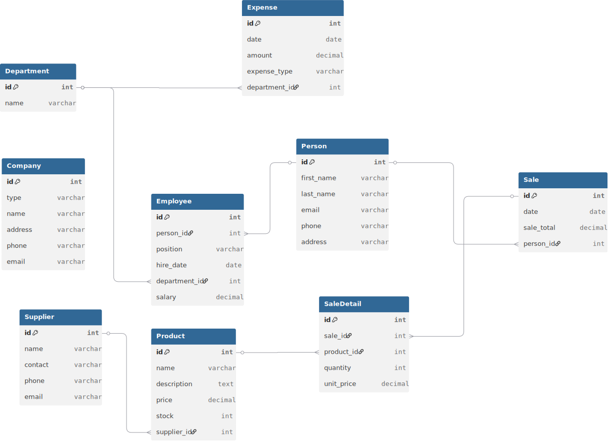
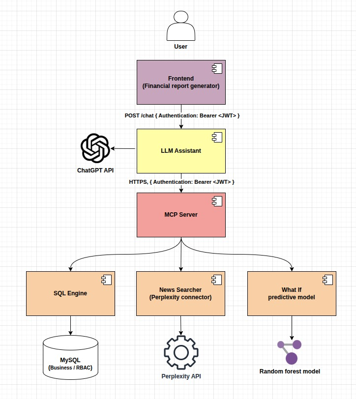

# Liquid - MCP MySQL Server & Client

Sistema modular para ejecutar queries SQL en MySQL usando el protocolo MCP (Model Context Protocol) con integración a ChatGPT y interfaz web interactiva.

## Arquitectura

El proyecto está organizado en componentes independientes y desplegables:

```
.
├── server/                    # Servidor MCP
│   ├── Dockerfile
│   ├── mcp_server.py
│   ├── db_connection.py
│   ├── requirements.txt
│   └── tools/                # Herramientas MCP adicionales
│
├── client/                    # Cliente MCP (Python)
│   ├── Dockerfile
│   ├── mcp_client.py
│   ├── chatgpt_mcp_integration.py
│   ├── main.py
│   └── requirements.txt
│
├── web/                       # 🎨 Aplicación Web (Next.js)
│   ├── Dockerfile
│   ├── app/                  # Páginas y rutas
│   │   ├── dashboard/
│   │   ├── editor/
│   │   ├── history/
│   │   └── ...
│   ├── components/           # Componentes React
│   ├── lib/                  # Utilidades y cliente MCP
│   ├── public/              # Recursos estáticos
│   └── package.json
│
├── database/                  # Base de Datos MySQL
│   ├── Dockerfile
│   ├── init_mysql_data.py   # Generador de datos mock
│   └── requirements.txt
│
├── img/                       # 📊 Documentación visual
│   ├── db_schema.svg         # Esquema de BD
│   └── business_topology.jpeg
│
├── docker-compose.yml         # Orquestación de servicios
├── .env.example              # Variables de entorno
└── README.md                 # Documentación principal
```

## Componentes

### 1. Servidor MCP (`server/`)

Servidor que expone herramientas MCP para ejecutar queries SELECT en MySQL y explorar el esquema de la base de datos.

**Herramientas disponibles:**
- `execute_select_query` - Ejecuta queries SELECT
- `list_tables` - Lista todas las tablas disponibles
- `describe_table` - Describe la estructura de una tabla
- `get_database_schema` - Obtiene el esquema completo de la BD

**Características:**
- Validación de queries (solo SELECT)
- Soporte para queries parametrizadas
- Exploración automática de esquema
- Gestión de conexiones MySQL
- Construido con FastMCP

### 2. Cliente MCP (`client/`)

Cliente que consume el servidor MCP con dos capas:

**`mcp_client.py`** - Cliente básico
- Conexión directa al servidor MCP
- Ejecución de queries
- Listado de herramientas disponibles

**`chatgpt_mcp_integration.py`** - Integración ChatGPT
- Function calling de OpenAI
- **Exploración automática de esquema** - ChatGPT descubre la estructura de la BD
- Generación de queries SQL precisas
- Conversaciones multi-turno
- Streaming de respuestas
- Contexto persistente

**💡 Capacidad destacada:** ChatGPT puede explorar el esquema de la base de datos automáticamente antes de generar queries, asegurando SQL correcto sin necesidad de conocer la estructura previamente.

**`chat_api.py`** - 🌟 **API REST + Interfaz Web**
- API REST completa con FastAPI
- Interfaz web moderna y responsive
- Gestión de sesiones de chat
- Endpoints para todas las operaciones
- Health checks y monitoreo

**🎯 Para usuarios finales:** Interfaz web en `http://localhost:8080` donde cualquiera puede hacer preguntas sobre la base de datos en lenguaje natural.

### 4. Componente Web (`web/`) 🎨

Aplicación web completa construida con **Next.js 16** y **React 19** que proporciona una interfaz moderna para interactuar con el sistema MCP.

**Stack Tecnológico:**
- **Framework:** Next.js 16 (App Router)
- **UI:** React 19 + TypeScript
- **Estilos:** Tailwind CSS 4
- **Componentes:** Radix UI (accesibilidad AAA)
- **Gráficos:** Recharts para visualizaciones
- **Cliente MCP:** SDK oficial de Model Context Protocol
- **Animaciones:** GSAP para transiciones fluidas

**Módulos Principales:**
- **Dashboard** (`app/dashboard/`) - Panel de control con métricas en tiempo real
- **Editor** (`app/editor/`) - Editor de queries SQL con sintaxis highlighting
- **Export** (`app/export/`) - Exportación de resultados a múltiples formatos
- **History** (`app/history/`) - Historial de queries ejecutadas
- **Preview** (`app/preview/`) - Vista previa de datos y resultados
- **Schedule** (`app/schedule/`) - Programación de queries recurrentes
- **Tool Selection** (`app/tool-selection/`) - Selector de herramientas MCP disponibles

**Características:**
- 🎨 Interfaz responsive con diseño moderno
- 🔄 Drag & drop para organización de elementos
- 📊 Visualizaciones interactivas de datos
- 🌙 Tema claro/oscuro
- ♿ Accesibilidad completa (WCAG 2.1)
- 🚀 Optimizado para rendimiento
- 📱 Progressive Web App (PWA)

### 5. Base de Datos (`database/`)

MySQL con datos de ejemplo pre-cargados con datos realistas de negocio:
- 🏢 Tablas de negocio completas (clientes, productos, órdenes, transacciones, etc.)
- 📊 Datos generados automáticamente con relaciones realistas
- 🔄 Scripts de inicialización automática
- 💾 Esquema normalizado optimizado para queries

**Esquema de Base de Datos:**



*Esquema completo de la base de datos mostrando todas las tablas y relaciones*

**Topología de Negocio:**



*Visualización de la arquitectura de negocio y flujo de datos del sistema*

## Arquitectura de Comunicación

El sistema utiliza una arquitectura modular con múltiples capas de comunicación:

```
┌─────────────────────────────────────────────────────────────────┐
│                      CAPA DE PRESENTACIÓN                        │
│                                                                   │
│  ┌──────────────────┐              ┌──────────────────┐         │
│  │   Web UI (Next)  │              │   Cliente Python │         │
│  │   Port: 3000     │              │   CLI/Scripts    │         │
│  └────────┬─────────┘              └────────┬─────────┘         │
│           │                                  │                   │
└───────────┼──────────────────────────────────┼───────────────────┘
            │                                  │
            │ HTTP/WebSocket                   │ HTTP (SSE)
            │                                  │
┌───────────┼──────────────────────────────────┼───────────────────┐
│           │         CAPA DE APLICACIÓN       │                   │
│           ▼                                  ▼                   │
│  ┌──────────────────────────────────────────────────────────┐   │
│  │              Servidor MCP (FastMCP)                       │   │
│  │                   Port: 8000                              │   │
│  │                                                            │   │
│  │  Tools: execute_query, list_tables, describe_table...    │   │
│  └─────────────────────────┬──────────────────────────────────┘   │
└────────────────────────────┼──────────────────────────────────────┘
                             │
                             │ MySQL Protocol (3306)
                             ▼
┌─────────────────────────────────────────────────────────────────┐
│                     CAPA DE DATOS                                │
│                                                                   │
│                  ┌───────────────────┐                           │
│                  │   MySQL Database  │                           │
│                  │     Port: 3306    │                           │
│                  └───────────────────┘                           │
└─────────────────────────────────────────────────────────────────┘
```

**Ventajas de esta arquitectura:**
- ✅ Múltiples interfaces (Web + CLI) compartiendo el mismo backend
- ✅ Comunicación eficiente con SSE (Server-Sent Events)
- ✅ Funciona perfectamente en Docker
- ✅ Permite múltiples clientes simultáneos
- ✅ Health checks via HTTP
- ✅ Fácil de debuggear y monitorear
- ✅ Escalable horizontalmente

Ver [TRANSPORT.md](TRANSPORT.md) para más detalles técnicos.

## Quick Start

### Opción 1: Interfaz Web (Más Fácil) 🌟

La forma más rápida de empezar es usando la aplicación web:

```bash
# 1. Configurar variables de entorno
cp .env.example .env
# Edita .env y añade tu OPENAI_API_KEY (opcional para el dashboard)

# 2. Iniciar todos los servicios
docker-compose up -d

# 3. Abrir interfaz web en navegador
# Aplicación principal:
http://localhost:3000

# ¡Listo! Ahora puedes:
# - Ver el dashboard con métricas en tiempo real
# - Ejecutar queries SQL con el editor interactivo
# - Explorar el esquema de la base de datos
# - Visualizar resultados con gráficos
# - Exportar datos en múltiples formatos
```

**Interfaces disponibles:**
- 🎨 **Web UI:** `http://localhost:3000` - Aplicación Next.js completa
- 🔧 **MCP Server:** `http://localhost:8000` - API del servidor MCP
- 🗄️ **MySQL:** `localhost:3306` - Base de datos directa

### Opción 2: Docker con Scripts Python

```bash
# 1. Configurar variables de entorno
cp .env.example .env
# Edita .env y añade tu OPENAI_API_KEY

# 2. Iniciar servicios
docker-compose up -d

# 3. Verificar que el servidor está corriendo
curl http://localhost:8000/sse
# Debe retornar código 200

# 4. Ejecutar ejemplos
docker-compose run --rm mcp-client python examples/basic_usage.py
docker-compose run --rm mcp-client python examples/chatgpt_usage.py
docker-compose run --rm mcp-client python examples/schema_exploration.py
```

### Opción 2: Local

```bash
# 1. Instalar dependencias
pip install -r requirements.txt

# 2. Configurar variables de entorno
export MYSQL_HOST=localhost
export MYSQL_DATABASE=test_db
export MYSQL_USER=test_user
export MYSQL_PASSWORD=test_password
export OPENAI_API_KEY=your-key

# 3. Iniciar servidor (terminal 1)
cd server
python mcp_server.py

# 4. Ejecutar cliente (terminal 2)
cd client
python examples/basic_usage.py
```

## Uso

### Cliente Básico

```python
from mcp_client import MySQLMCPClient

async with MySQLMCPClient() as client:
    result = await client.execute_query(
        query="SELECT * FROM users WHERE age > %s",
        params=[18]
    )
    print(result)
```

### Exploración de Esquema

```python
from mcp_client import MySQLMCPClient

async with MySQLMCPClient() as client:
    # Listar todas las tablas
    tables = await client.client.call_tool("list_tables")

    # Describir una tabla específica
    schema = await client.client.call_tool("describe_table", table_name="users")

    # Obtener esquema completo
    full_schema = await client.client.call_tool("get_database_schema")
```

### ChatGPT con Exploración Automática de Esquema

```python
from chatgpt_mcp_integration import ChatGPTMCPIntegration

async with ChatGPTMCPIntegration(api_key=key) as integration:
    # ChatGPT explora el esquema automáticamente
    response = await integration.chat(
        user_message="Muéstrame todos los usuarios con sus emails",
        system_prompt="""Eres un asistente de base de datos. Siempre:
        1. Explora el esquema antes de generar queries
        2. Genera SQL preciso basado en la estructura real
        3. Explica tus hallazgos claramente"""
    )
    print(response)
    # ChatGPT llamará a describe_table("users") primero
    # Luego generará: SELECT username, email FROM users;
```

**Ver ejemplos completos:**
- `client/examples/basic_usage.py` - Uso básico del cliente
- `client/examples/chatgpt_usage.py` - ChatGPT básico
- `client/examples/schema_exploration.py` - **Exploración de esquema con ChatGPT**

**Documentación detallada:** [SCHEMA_TOOLS.md](SCHEMA_TOOLS.md)

### Interfaz Web

La aplicación web proporciona una experiencia completa e interactiva:

```bash
# 1. Asegurarse que todos los servicios están corriendo
docker-compose up -d

# 2. Acceder a la interfaz web
# Abrir en el navegador: http://localhost:3000

# 3. Navegar por los módulos disponibles:
# - Dashboard: Vista general y métricas del sistema
# - Editor: Escribir y ejecutar queries SQL
# - History: Revisar queries anteriores
# - Export: Descargar resultados en CSV, JSON, Excel
# - Schedule: Programar queries recurrentes
```

**Desarrollo local del componente web:**

```bash
cd web

# Instalar dependencias
npm install

# Ejecutar en modo desarrollo
npm run dev
# La app estará disponible en http://localhost:3000

# Build para producción
npm run build
npm start
```

**Tecnologías del componente web:**
- Frontend moderno con React 19 y TypeScript
- Diseño responsive con Tailwind CSS 4
- Componentes accesibles de Radix UI
- Gráficos interactivos con Recharts
- Cliente MCP integrado para comunicación con el servidor

## Comandos Docker

```bash
# Iniciar todos los servicios (base de datos + MCP server + web)
docker-compose up -d

# Ver las aplicaciones web
# - Web UI: http://localhost:3000
# - MCP Server: http://localhost:8000

# Iniciar servicios específicos
docker-compose up -d mysql mcp-server web

# Ver logs de los servicios
docker-compose logs -f mcp-server    # Logs del servidor MCP
docker-compose logs -f web           # Logs de la aplicación web
docker-compose logs -f mysql         # Logs de MySQL

# Ver estado de los servicios
docker-compose ps

# Reiniciar un servicio específico
docker-compose restart web
docker-compose restart mcp-server

# Ejecutar comandos en el cliente Python
docker-compose run --rm mcp-client python examples/basic_usage.py

# Acceder a shell en contenedores
docker-compose exec web sh           # Shell en el contenedor web
docker-compose exec mysql bash       # Shell en MySQL

# Detener todos los servicios
docker-compose down

# Limpiar todo (incluye volúmenes y datos)
docker-compose down -v

# Reconstruir imágenes
docker-compose build
docker-compose up -d --build
```

## Desarrollo

### Estructura de Carpetas

Cada componente es independiente:
- **server/** - Puede desplegarse solo
- **client/** - Puede conectarse a cualquier servidor MCP
- **database/** - Scripts de inicialización reutilizables

### Hot Reload

Los volúmenes están montados en modo lectura:

```yaml
volumes:
  - ./server/mcp_server.py:/app/mcp_server.py:ro
```

Reinicia el contenedor para aplicar cambios:

```bash
docker-compose restart mcp-server
```

### Añadir Ejemplos

Coloca nuevos ejemplos en `client/examples/`:

```bash
docker-compose run --rm mcp-client python examples/mi_ejemplo.py
```

## Configuración

### Variables de Entorno

**Importante:** Las credenciales se gestionan mediante archivos `.env` para mayor seguridad.

```bash
# 1. Copiar el template
cp .env.example .env

# 2. Editar con tus credenciales
nano .env

# 3. Configurar permisos restrictivos
chmod 600 .env
```

Contenido de `.env`:

```env
# OpenAI
OPENAI_API_KEY=sk-tu-api-key-aqui

# MySQL
MYSQL_HOST=localhost
MYSQL_PORT=3306
MYSQL_DATABASE=test_db
MYSQL_USER=test_user
MYSQL_PASSWORD=tu_password_seguro_aqui
MYSQL_ROOT_PASSWORD=tu_root_password_aqui
```

**⚠️ NUNCA** commitear el archivo `.env` a git - está protegido por `.gitignore`

### Seguridad

**Mejoras implementadas:**
- ✅ No hay credenciales hardcodeadas en Dockerfiles
- ✅ Variables sensibles cargadas desde archivo `.env`
- ✅ `.env` excluido del control de versiones
- ✅ `.env.example` como template seguro

**Para producción:**
1. Cambiar TODAS las contraseñas por defecto
2. Usar [Docker secrets](https://docs.docker.com/engine/swarm/secrets/)
3. No exponer puertos innecesarios
4. Configurar SSL/TLS para MySQL
5. Ver [SECURITY.md](SECURITY.md) para más detalles

## Testing

```bash
# Ejecutar tests del servidor
docker-compose run --rm mcp-server python -m pytest

# Ejecutar tests del cliente
docker-compose run --rm mcp-client python -m pytest
```

## Troubleshooting

### Error de conexión a MySQL

```bash
# Verificar que MySQL está listo
docker-compose logs mysql

# Probar conexión manualmente
docker-compose exec mysql mysql -u test_user -ptest_password test_db
```

### Cliente no encuentra el servidor

Verifica que estén en la misma red:

```bash
docker network inspect liquid-network
```

### Variables de entorno no se cargan

```bash
# Verificar archivo .env
cat .env

# Reiniciar servicios
docker-compose down && docker-compose up -d
```

## Documentación

### Guías del Proyecto
- [CHAT_API.md](CHAT_API.md) - 🌟 **API REST e Interfaz Web** (empezar aquí)
- [SCHEMA_TOOLS.md](SCHEMA_TOOLS.md) - Herramientas de exploración de esquema
- [TRANSPORT.md](TRANSPORT.md) - Configuración de transporte MCP
- [SECURITY.md](SECURITY.md) - Mejores prácticas de seguridad
- [STRUCTURE.md](STRUCTURE.md) - Arquitectura del proyecto
- [README.Docker.md](README.Docker.md) - Guía detallada de Docker

### Referencias Externas
- [FastMCP](https://github.com/jlowin/fastmcp) - Framework MCP usado
- [OpenAI Function Calling](https://platform.openai.com/docs/guides/function-calling) - Integración ChatGPT
- [FastAPI](https://fastapi.tiangolo.com/) - Framework de la API REST

## Licencia

MIT

## Contribuir

1. Fork el repositorio
2. Crea una rama para tu feature
3. Haz commit de tus cambios
4. Push a la rama
5. Abre un Pull Request
